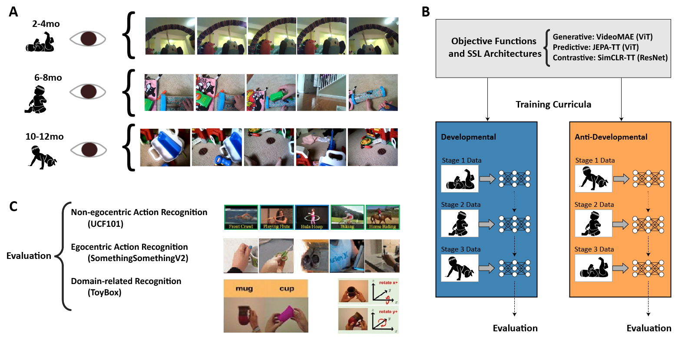

# Curriculum Learning With Infant Egocentric Videos (Neurips 2023 Spotlight)
Saber Sheybani, Himanshu Hansaria, Justin Newell Wood, Linda B. Smith, Zoran Tiganj

#### Links: (Preprint), (Video)

<div style="text-align: center;"></div>

## Abstract:

Infants possess a remarkable ability to rapidly learn and process visual inputs. As an infant's mobility increases, so does the variety and dynamics of their visual inputs. Is this change in the properties of the visual inputs beneficial or even critical for the proper development of the visual system? To address this question, we used video recordings from infants wearing head-mounted cameras to train a variety of self-supervised learning models. Critically, we separated the infant data by age group and evaluated the importance of training with a curriculum aligned with developmental order. We found that initiating learning with the data from the youngest age group provided the strongest learning signal and led to the best learning outcomes in terms of downstream task performance. We then showed that the benefits of the data from the youngest age group are due to the slowness and simplicity of the visual experience. The results provide strong empirical evidence for the importance of the properties of the early infant experience and developmental progression in training. More broadly, our approach and findings take a noteworthy step towards reverse engineering the learning mechanisms in newborn brains using image-computable models from artificial intelligence.


## Code base Organization
```
baby-vision-curriculum
└── pretraining: python code used for pretraining the models with various objectives and architectures
│   ├── generative
│   |   └── pretrain_videomae.py
│   ├── predictive
│   |   └── pretrain_jepa.py
│   └── contrastive
│       └── pretrain_simclr.py
│
└── benchmarks: python code used for benchmarking any checkpoint on the tasks
│   ├── compute_embeddings_videomae.py
│   ├── compute_embeddings_jepa.py
│   ├── compute_embeddings_simclr.py
│
└── slurmscripts: linux bash code used for submitting jobs that train and evaluate models.
│
├── notebooks: Jupyter notebook files used for creating the figures in the manuscript.
    └── EvaluateEmbeddings.ipynb
```


## Dependencies:
+ pytorch
+ torchvision
+ huggingface transformers (for VideoMAE)
+ tqdm

VideoMAE models need to be pretrained on multiple GPUs as they take up substantial GPU memory. We use PyTorch DistributedDataParallel for that.

### Citation

```
  @article{sheybani23curriculum,
    title={Curriculum Learning with Infant Egocentric Videos},
    author={Sheybani, Saber and Hansaria, Himanshu and Wood, Justin and Smith, Linda and Tiganj, Zoran},
    journal={Advances in Neural Information Processing Systems},
    year={2023}
  }
```
